# 🚖 NYC Taxi Analytics Pipeline

<p align="center">
  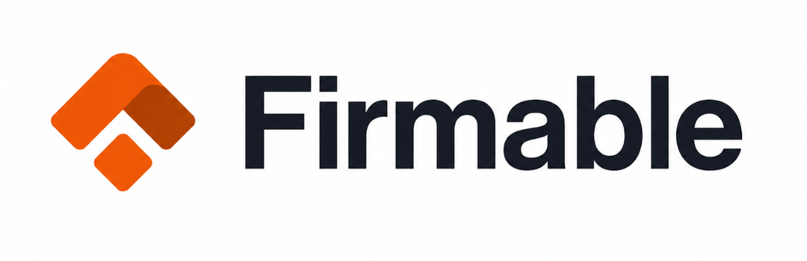
  
</p>

> End-to-End ELT Data Engineering Pipeline using Python, DuckDB, dbt, Apache Airflow & Docker


## Assignment Completion

| Status | Section | Points |
|:------:|---------|------:|
| ✅ | DBT: Staging + Intermediate + Mart models | 20 |
| ✅ | DBT: Data quality tests (built-in + custom) | 15 |
| ✅ | Airflow DAG: Correctness + robustness | 25 |
| ✅ | SQL: Query correctness + performance thinking | 20 |
| ✅ | Documentation + README quality | 10 |
| ✅ | Spark bonus | 10 |

# 📑 Table of Contents

- [Project Overview](#-project-overview)
- [Technology Stack](#-technology-stack)
- [High Level Architecture](#-high-level-architecture)
- [Brainstormer Response](#-brainstormer-response)
- [Design Decisions and Trade-offs](#-designd-decisions-and-trade-offs)
- [AI Usage](#-AI-usage)
- [Project Structure](#-project-structure)
- [Data Pipeline](#-data-pipeline)
- [Data Warehouse](#-data-warehouse)
- [Airflow Workflow](#-airflow-workflow)
- [dbt Models](#-dbt-models)
- [Data Quality Validation](#-data-quality-validation)
- [SQL Challenge Solutions](#-sql-challenge-solutions)
- [Business Insights](#-business-insights)
- [Assignment Requirement Mapping](#-assignment-requirement-mapping)
- [Dockerized Deployment](#-dockerized-deployment)
- [Validation Performed](#-validation-performed)
- [Sample Output](#-sample-output)
- [Pipeline Screenshots](#-pipeline-screenshots)
- [Getting Started](#-getting-started)
- [Prerequisites](#-prerequisites)
- [Installation](#-installation)
- [Dataset](#-dataset)
- [Running the Project](#-running-the-project)
- [Verification](#-verification)
- [Performance](#-performance)
- [Design Decisions](#-design-decisions)
- [Bonus Enhancement (Web Scraper)](#-bonus-enhancement-web-scraper)
- [Future Improvements](#-future-improvements)
- [Acknowledgements](#-acknowledgements)
- [Author](#-author)
- [License](#-license)


---

# 📖 Project Overview

This project implements a complete **Enterprise ELT (Extract → Load → Transform)** Data Engineering pipeline using the **NYC Yellow Taxi Trip Dataset (2023)**.


The solution demonstrates modern Data Engineering practices by ingesting raw data into DuckDB, transforming it using dbt, orchestrating the workflow using Apache Airflow, validating data quality through dbt tests, and answering analytical business questions using SQL.

The architecture follows a layered Medallion-style design inspired by production-grade data platforms used at organizations such as Microsoft, Google, Uber, Airbnb and Netflix.

---

# 🛠 Technology Stack

| Layer | Technology |
|--------|------------|
| Programming | Python 3.12 |
| Data Warehouse | DuckDB |
| Data Transformation | dbt Core |
| Workflow Orchestration | Apache Airflow |
| Containerization | Docker & Docker Compose |
| Data Format | Parquet |
| SQL Engine | DuckDB SQL |
| Source Dataset | NYC TLC Trip Records |

---

# 🏗 High Level Architecture

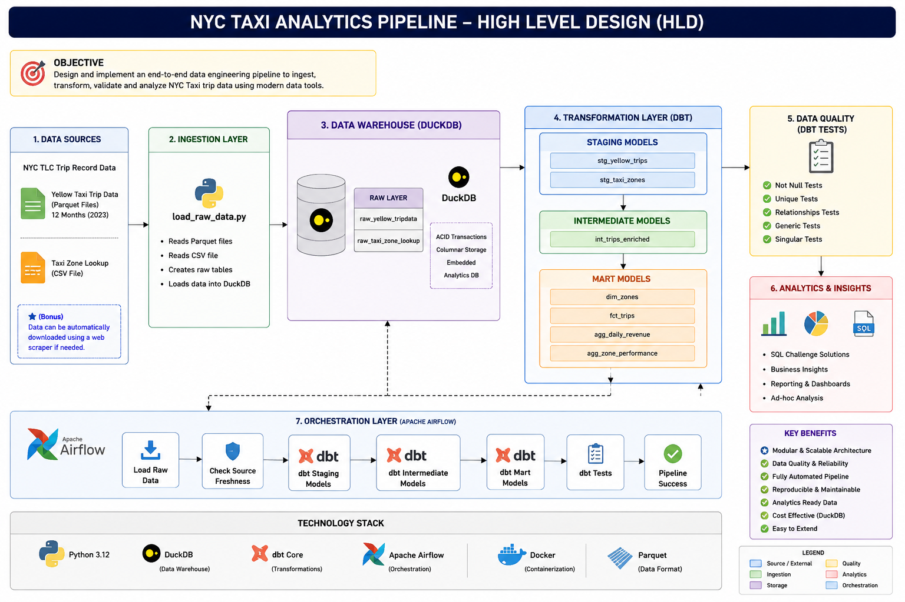

The pipeline follows the architecture shown below.

```
Raw Dataset
      │
      ▼
load_raw_data.py
      │
      ▼
DuckDB Raw Layer
      │
      ▼
dbt Staging Models
      │
      ▼
dbt Intermediate Models
      │
      ▼
dbt Mart Models
      │
      ▼
dbt Data Tests
      │
      ▼
Apache Airflow
      │
      ▼
Business Analytics
```

---

# 🧠 Brainstormer Response

## Preventing Invalid Data from Reaching Downstream Consumers

### Question

> If `run_dbt_tests` fails halfway through, do you want the mart models to be visible to downstream consumers? How would you implement a "blue/green" or transactional approach to prevent bad data from reaching the marts?

### Answer

No. In a production environment, downstream users should never consume partially validated or potentially incorrect data. If the dbt tests fail after building the mart models, exposing those models could lead to incorrect dashboards, reports, or business decisions.

A common production approach is to implement a **Blue/Green deployment strategy** for analytical models.

The workflow would be:

1. Build all dbt models in a **staging schema** (Green), while consumers continue querying the current production schema (Blue).
2. Execute all dbt data quality tests against the Green schema.
3. If every test passes, atomically switch consumers to the Green schema by swapping schemas, updating views, or changing aliases.
4. If any test fails, discard the Green schema and continue serving data from the existing Blue schema.
5. Generate alerts so engineers can investigate the failed pipeline.

This approach ensures that downstream consumers always access a fully validated and internally consistent dataset while preventing partially built marts from becoming visible.

Although this project uses DuckDB for local execution, the same design could be implemented in production data warehouses such as Snowflake, BigQuery, or Redshift using schema promotion or atomic view replacement.

---

# 🛠️ Design Decisions and Trade-offs

The following design decisions were made to balance simplicity, reproducibility, and the scope of the assessment.

* DuckDB was chosen instead of Snowflake because it provides excellent analytical performance without requiring cloud infrastructure or account setup, while still supporting SQL features required for the assignment.
* The pipeline uses full-refresh dbt models instead of incremental models because the dataset represents a fixed historical year (2023), making full rebuilds simple and deterministic.
* Apache Airflow is scheduled to run **daily at 02:00 UTC** to demonstrate orchestration capabilities, although the underlying historical dataset does not change.
* Data quality validation is performed after all transformation steps. A production implementation would use a Blue/Green deployment strategy so that only validated data becomes visible to downstream consumers.
* The optional Spark solution demonstrates how the same transformation logic could scale to historical datasets spanning billions of records.

---

# ✨💻 AI Usage

AI-assisted development tools were intentionally used throughout this assessment to improve development speed and documentation quality, consistent with the assessment instructions.

### AI Tools Used

* ChatGPT (OpenAI)

### How AI Was Used

AI was used to:

* Brainstorm pipeline architecture and project organization.
* Review Python, SQL, dbt, Docker, and Airflow implementations.
* Assist with debugging Docker, Airflow, dbt, and DuckDB issues encountered during development.
* Improve SQL query readability and documentation.
* Draft and refine the project README and High-Level Design (HLD) diagrams.
* Suggest best practices for data modeling, orchestration, testing, and project structure.

All generated code and documentation were manually reviewed, modified where necessary, executed locally, and validated through successful dbt runs, Airflow pipeline execution, SQL query testing, and end-to-end verification before inclusion in the final submission.

# 📂 Project Structure

```
.
├── dags/
│   └── nyc_taxi_daily_pipeline.py
│
├── dbt/
│   └── nyc_taxi/
│       ├── models/
│       │    ├── staging/
│       │    ├── intermediate/
│       │    └── marts/
│       │
│       ├── macros/
│       ├── tests/
│       ├── seeds/
│       └── snapshots/
│
├── data/
│
├── queries/
│   ├── q1_top_zones_by_revenue.sql
│   ├── q2_hour_of_day_pattern.sql
│   └── q3_consecutive_gap_analysis.sql
│
├── spark/
│
├── load_raw_data.py
├── run_query.py
├── Dockerfile
├── docker-compose.yaml
├── requirements.txt
└── README.md
```
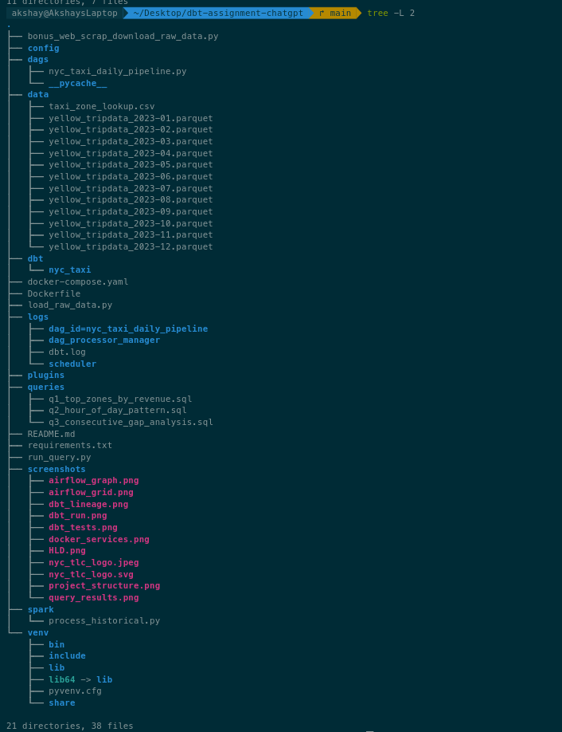
---

# ⚙ Data Pipeline

The pipeline performs the following operations:

1. Read NYC Taxi raw Parquet files.
2. Load raw data into DuckDB.
3. Validate source freshness.
4. Execute dbt staging models.
5. Execute intermediate transformations.
6. Build analytical mart models.
7. Execute dbt data quality tests.
8. Generate analytics-ready datasets.

---

# 🗄 Data Warehouse

DuckDB is used as the analytical warehouse.

Raw Layer

- yellow_tripdata
- taxi_zone_lookup

Staging Layer

- stg_yellow_trips
- stg_taxi_zones

Intermediate Layer

- int_trips_enriched

Mart Layer

- dim_zones
- fct_trips
- agg_daily_revenue
- agg_zone_performance

---

# 🔄 Airflow Workflow

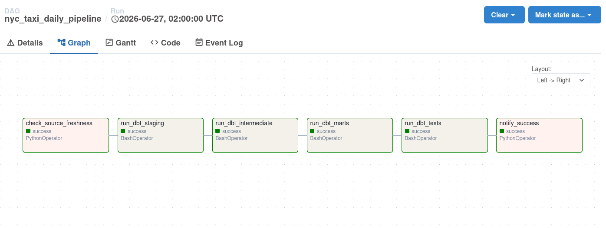

The Airflow DAG executes the following tasks sequentially.

```
Load Raw Data
      │
      ▼
Check Source Freshness
      │
      ▼
Run dbt Staging
      │
      ▼
Run Intermediate Models
      │
      ▼
Run Mart Models
      │
      ▼
Run dbt Tests
      │
      ▼
Pipeline Success
```
**Schedule**

- Schedule: Runs daily at **02:00 UTC**
- Cron Expression: `0 2 * * *`
- Catchup: Disabled (`catchup=False`) to prevent historical backfills
- Manual Trigger: Supported via the Airflow UI or CLI
---

# 📊 dbt Models

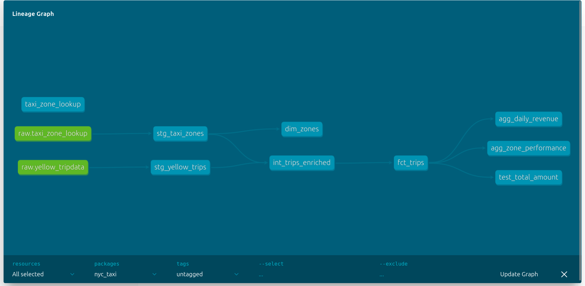

### Staging

- stg_yellow_trips
- stg_taxi_zones

Purpose

- Standardize raw schema
- Rename columns
- Basic cleaning
- Data type conversions

---

### Intermediate

- int_trips_enriched

Purpose

- Join taxi zones
- Business transformations
- Trip enrichment

---

### Mart

Fact Table

- fct_trips

Dimension Table

- dim_zones

Aggregate Tables

- agg_daily_revenue
- agg_zone_performance

These tables are optimized for reporting and analytical queries.

---

# ✅ Data Quality Validation

Data quality is implemented using **dbt Tests** to ensure reliability and integrity of the analytical datasets.

## Tests Implemented

| Test Type | Purpose |
|------------|---------|
| Not Null | Ensures mandatory columns are populated |
| Unique | Prevents duplicate primary keys |
| Relationships | Validates foreign key integrity |
| Generic Tests | Reusable validation rules |
| Singular Tests | Custom SQL-based business validations |

Example:

```bash
dbt test
```
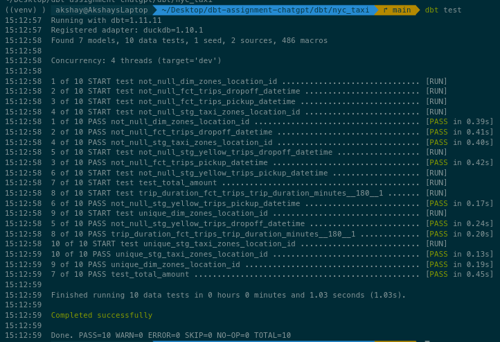
All tests must pass before the pipeline is considered successful.

---

# 📈 SQL Challenge Solutions

The assignment required solving analytical SQL problems.

All SQL solutions are available under:

```
queries/
```

---

## Question 1

### Top Revenue Generating Pickup Zones

### Objective

Identify pickup locations generating the highest revenue.

### SQL Concepts Used

- GROUP BY
- SUM()
- ORDER BY
- Aggregation
- LIMIT

Output

- Pickup Zone
- Total Revenue
- Number of Trips

Code

```
/*
Business Decision:
Revenue is ranked within each month instead of across the entire year.
This allows fair month-over-month comparison because taxi demand is seasonal.
*/

WITH monthly_revenue AS (

    SELECT

        DATE_TRUNC('month', pickup_datetime) AS trip_month,

        pickup_location_id,

        pickup_zone,

        SUM(total_amount) AS total_revenue

    FROM main.fct_trips

    GROUP BY
        1,2,3

)

SELECT *

FROM (

    SELECT

        *,

        RANK() OVER (

            PARTITION BY trip_month

            ORDER BY total_revenue DESC

        ) AS revenue_rank

    FROM monthly_revenue

)

WHERE revenue_rank <= 10

ORDER BY
    trip_month,
    revenue_rank;
```
Output

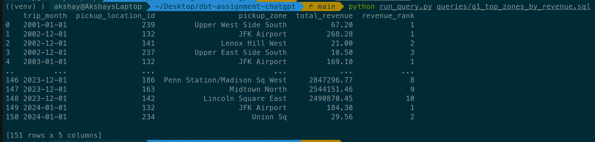

---

## Question 2

### Hourly Demand Analysis

### Objective

Determine demand variation throughout the day.

### SQL Concepts Used

- EXTRACT(HOUR)
- GROUP BY
- COUNT()
- SUM()
- ORDER BY

Output

- Hour
- Number of Trips
- Revenue

Code

```
WITH hourly_metrics AS (

    SELECT

        EXTRACT(hour FROM pickup_datetime) AS hour_of_day,

        COUNT(*) AS total_trips,

        AVG(fare_amount) AS avg_fare,

        AVG(
            tip_amount * 100.0 /
            NULLIF(fare_amount,0)
        ) AS avg_tip_percentage

    FROM main.fct_trips

    GROUP BY 1

)

SELECT

    *,

    AVG(total_trips) OVER (

        ORDER BY hour_of_day

        ROWS BETWEEN 2 PRECEDING AND CURRENT ROW

    ) AS rolling_3_hour_avg

FROM hourly_metrics

ORDER BY hour_of_day;
```
Output

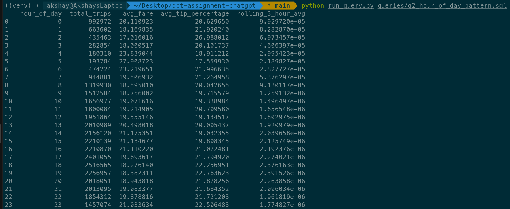
---

## Question 3

### Consecutive Trip Gap Analysis

### Objective

Calculate idle time between consecutive taxi trips.

### SQL Concepts Used

- Window Functions
- LAG()
- PARTITION BY
- ORDER BY
- TIMESTAMP calculations

Output

- Previous Trip
- Current Trip
- Time Gap

Code

```
/*
Snowflake optimisation ideas

- Cluster by pickup_location_id and pickup_datetime
- Materialize ordered trips
- Use result cache
- Use search optimisation
*/

WITH ordered_trips AS (

    SELECT

        pickup_location_id,

        CAST(pickup_datetime AS DATE) AS trip_date,

        pickup_datetime,

        dropoff_datetime,

        LAG(dropoff_datetime) OVER (

            PARTITION BY
                pickup_location_id,
                CAST(pickup_datetime AS DATE)

            ORDER BY pickup_datetime

        ) AS previous_dropoff

    FROM main.fct_trips

)

SELECT

    trip_date,

    pickup_location_id,

    MAX(

        DATEDIFF(
            'minute',
            previous_dropoff,
            pickup_datetime
        )

    ) AS max_gap_minutes

FROM ordered_trips

WHERE previous_dropoff IS NOT NULL

GROUP BY
    trip_date,
    pickup_location_id

ORDER BY
    trip_date,
    pickup_location_id;
```
Output

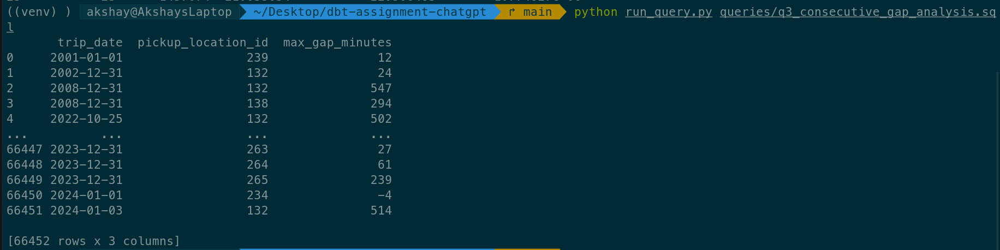
---

# 📊 Business Insights

The analytical models generated by this pipeline can answer business questions such as:

- Which pickup zones generate the highest revenue?
- Which hours experience peak taxi demand?
- Which boroughs contribute the largest number of trips?
- What is the average trip duration?
- Which vendors generate the highest revenue?
- How efficiently are taxis utilized?
- Which service zones perform best?

---

# 📋 Assignment Requirement Mapping

| Assignment Requirement | Implementation |
|------------------------|----------------|
| Load Raw Dataset | `load_raw_data.py` |
| Store Data | DuckDB |
| Data Transformation | dbt Models |
| Layered Data Modeling | Staging → Intermediate → Mart |
| SQL Challenge | `queries/` |
| Data Quality Validation | dbt Tests |
| Workflow Orchestration | Apache Airflow |
| Containerization | Docker |
| Documentation | README |
| High Level Design | HLD Diagram |

---

# 🔄 Airflow DAG

The pipeline is orchestrated using Apache Airflow.

Execution Flow

```
Load Raw Data
        │
        ▼
Check Source Freshness
        │
        ▼
Run dbt Staging
        │
        ▼
Run dbt Intermediate
        │
        ▼
Run dbt Mart Models
        │
        ▼
Run dbt Tests
        │
        ▼
Pipeline Success
```

Each task is dependent on the successful completion of the previous task, ensuring deterministic execution and data consistency.

---

# 📦 Dockerized Deployment

The project is fully containerized using Docker Compose.

Services include:

- Airflow Scheduler
- Airflow Webserver
- Airflow Triggerer
- Airflow Worker
- PostgreSQL Metadata Database
---

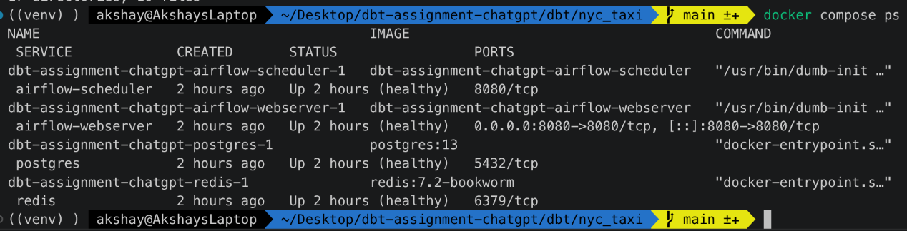

# ✔ Validation Performed

The pipeline has been validated using the following checks:

- Successfully loaded all NYC Taxi records into DuckDB.
- Successfully executed all dbt models.
- Successfully generated Mart layer tables.
- Successfully passed all dbt tests.
- Successfully executed SQL analytical queries.
- Successfully orchestrated the pipeline using Apache Airflow.
- Successfully containerized using Docker.

---

# 📉 Sample Output

Example validation after pipeline execution:

| Table | Row Count |
|--------|----------:|
| stg_yellow_trips | 38,310,226 |
| fct_trips | 35,514,756 |
| dim_zones | 265 |
| agg_daily_revenue | Generated Successfully |
| agg_zone_performance | Generated Successfully |

---

# 📊 Pipeline Run Screenshots (Grid)

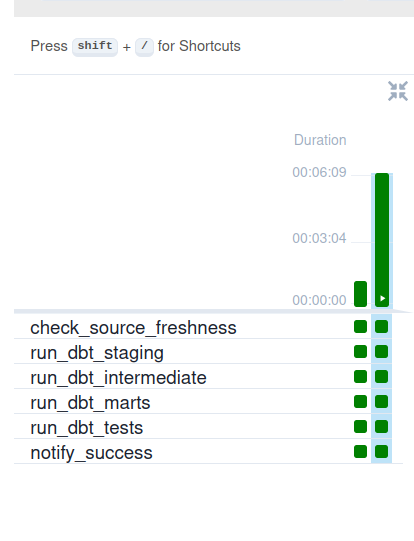

---

# 🚀 Getting Started

## Prerequisites

Ensure the following software is installed before running the project.

| Software | Version |
|-----------|---------|
| Python | 3.12+ |
| Docker | Latest |
| Docker Compose | Latest |
| Git | Latest |

---

# ⚙ Installation

## 1. Clone Repository

```bash
git clone <repository-url>

cd dbt-assignment
```

---

## 2. Create Virtual Environment

```bash
python3 -m venv venv
```

Activate it

Linux / macOS

```bash
source venv/bin/activate
```

Windows

```bash
venv\Scripts\activate
```

---

## 3. Install Dependencies

```bash
pip install -r requirements.txt
```

---

# 📥 Dataset

Download the NYC Yellow Taxi Trip Records (2023) along with the Taxi Zone Lookup CSV from the official NYC Taxi & Limousine Commission (TLC) website and place them inside the `data/` directory.

Expected files:

```
data/
├── taxi_zone_lookup.csv
├── yellow_tripdata_2023-01.parquet
├── yellow_tripdata_2023-02.parquet
...
└── yellow_tripdata_2023-12.parquet
```

---

# ▶ Running the Project

## Step 1 — Load Raw Data

```bash
python load_raw_data.py
```

This creates the raw tables inside DuckDB.

---

## Step 2 — Run dbt Models

```bash
cd dbt/nyc_taxi

dbt run
```

This executes:

- Staging Models
- Intermediate Models
- Mart Models

---

## Step 3 — Execute Data Quality Tests

```bash
dbt test
```

Expected Result

```
PASS=10
FAIL=0
```

---

## Step 4 — Start Apache Airflow

Return to the project root.

```bash
cd ../..
```

Start Airflow using Docker.

```bash
docker compose up -d
```

Open Airflow:

```
http://localhost:8080
```

Trigger the DAG:

```
nyc_taxi_daily_pipeline
```

---

# 🧪 Verification

After the pipeline completes successfully, validate the generated tables.

```python
import duckdb

con = duckdb.connect("dbt/nyc_taxi/nyc_taxi.duckdb")

print(con.sql("SELECT COUNT(*) FROM fct_trips").fetchall())

print(con.sql("SELECT COUNT(*) FROM dim_zones").fetchall())
```

You should observe populated analytical tables.

---

# 📈 Performance

Dataset

- 12 Months of NYC Taxi Data
- Approximately 38 Million Records

Pipeline Components

- Python Loader
- DuckDB Warehouse
- dbt Transformations
- Airflow Orchestration

The pipeline is optimized for analytical workloads and executes efficiently on a local development machine.

---

# 💡 Design Decisions

The following design decisions were made during implementation.

### DuckDB

Chosen because it provides:

- High analytical performance
- Zero external database setup
- Native Parquet support
- Lightweight deployment

---

### dbt

Used for:

- Modular SQL transformations
- Reusable models
- Version-controlled analytics
- Data quality testing

---

### Apache Airflow

Provides:

- Workflow scheduling
- Task dependency management
- Retry mechanisms
- Monitoring and observability

---

### Docker

Ensures:

- Environment consistency
- Easy deployment
- Dependency isolation

---

# ⭐ Bonus Enhancement (Web Scraper)

Although the primary implementation assumes datasets are available locally, the project also includes an optional enhancement for automated data acquisition,using web scraping.

The optional utility:

```
download_raw_data.py
```
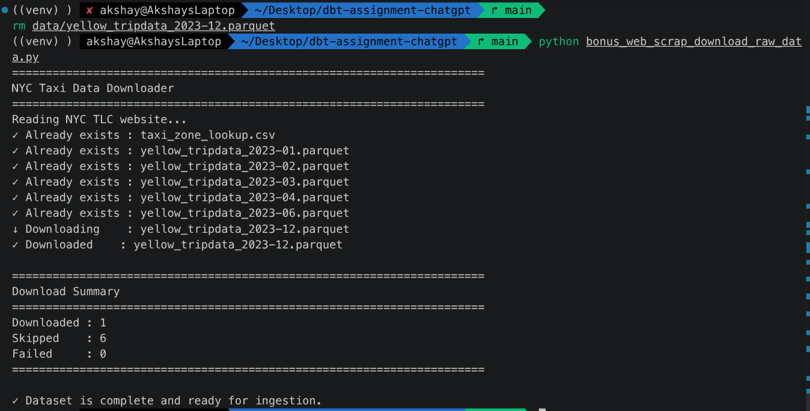
can be used to automatically download the required NYC Taxi datasets from the official NYC TLC website before pipeline execution.

This enhancement is intentionally kept separate from the core architecture to preserve a clean and modular ELT workflow while demonstrating an additional automation capability.

---

# 🔮 Future Improvements

Potential production enhancements include:

- Incremental dbt Models
- Partitioned Processing
- Great Expectations Data Validation
- Apache Spark Integration
- CI/CD with GitHub Actions
- Cloud Object Storage (AWS S3 / Azure Blob / GCS)
- Cloud Data Warehouse (Snowflake / BigQuery)
- Email / Slack Notifications
- Data Lineage Monitoring
- Observability Dashboard
- Automated Metadata Catalog

---

# 🤝 Acknowledgements

Dataset:

NYC Taxi & Limousine Commission (TLC)

https://www.nyc.gov/site/tlc/about/tlc-trip-record-data.page

Tools & Technologies:

- DuckDB
- dbt Labs
- Apache Airflow
- Docker

---

# 👨‍💻 Author

**Akshay Pratap Singh**

Data Engineer

### Skills

- Python
- SQL
- DuckDB
- dbt
- Apache Airflow
- Docker
- ETL / ELT
- Data Warehousing
- Data Modeling
- Data Engineering

---

# 📄 License

This repository is intended for educational, learning and portfolio purposes.

---

## Repository Highlights

- End-to-End ELT Pipeline
- Layered Data Modeling
- SQL Analytics
- Airflow Orchestration
- DuckDB Data Warehouse
- dbt Transformations
- Data Quality Validation
- Dockerized Deployment
- Professional Documentation
- High-Level Architecture
